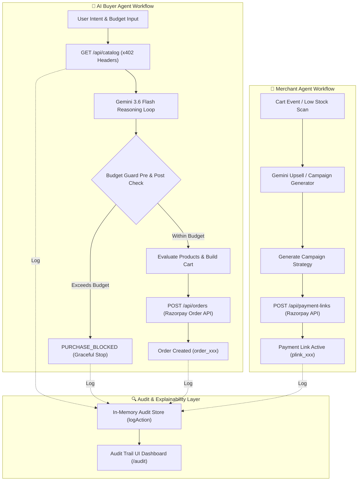
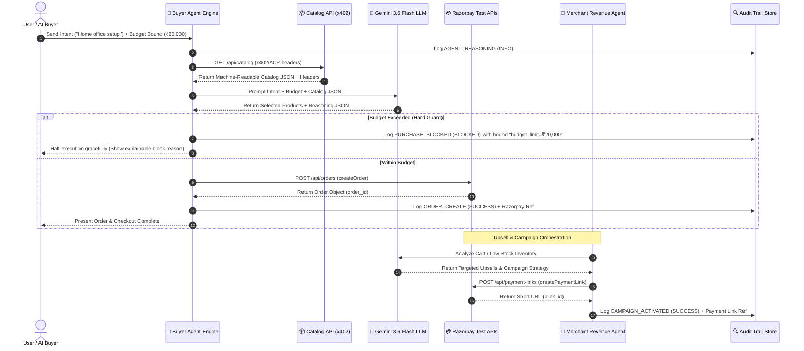

# ARIA — Autonomous Revenue Intelligence Agent
## Razorpay Buildathon 2025 | Track 01: AI Growth & Agentic Commerce

### Architecture Overview

```
┌─────────────────────────────────────────────────────────────┐
│                      ARIA Platform                           │
├──────────────────────┬──────────────────────────────────────┤
│    MERCHANT SIDE     │           BUYER SIDE                  │
│                      │                                       │
│  🏪 Merchant Agent  │    🤖 AI Buyer Agent                  │
│  ─────────────────  │    ─────────────────────              │
│  • Catalog Manager  │    • Natural language intent          │
│  • Upsell Engine    │    • Budget-bounded purchasing         │
│  • Campaign Orch.   │    • x402/ACP-style protocol          │
│  • Revenue Analyst  │    • Graceful failure handling        │
│                      │                                       │
├──────────────────────┴──────────────────────────────────────┤
│              Razorpay Test Mode APIs                         │
│   Orders | Payment Links | Subscriptions | Webhooks          │
├─────────────────────────────────────────────────────────────┤
│              Audit Trail & Explainability Layer              │
│   Every action: WHY • WHAT • BOUNDED BY • OUTCOME           │
└─────────────────────────────────────────────────────────────┘
```

### System Component Workflow Diagram



### Execution Sequence Workflow Diagram



### Component Breakdown

1. **Agent-Readable Catalog** — Structured product data with machine-readable pricing, inventory, and negotiation rules. Exposed via x402-inspired headers.

2. **Merchant Revenue Agent** — LLM-powered upsell/cross-sell running at checkout. Analyzes cart, suggests bundles, generates campaign payment links.

3. **AI Buyer Agent** — Simulates an autonomous AI buyer with budget constraints, decision logging, and x402-style payment authorization flow.

4. **Campaign Orchestrator** — Agent that auto-creates targeted payment link campaigns based on inventory and revenue goals.

5. **Explainability Dashboard** — Live audit trail with every action annotated: agent_id, action_type, bound, razorpay_ref, outcome, timestamp.

